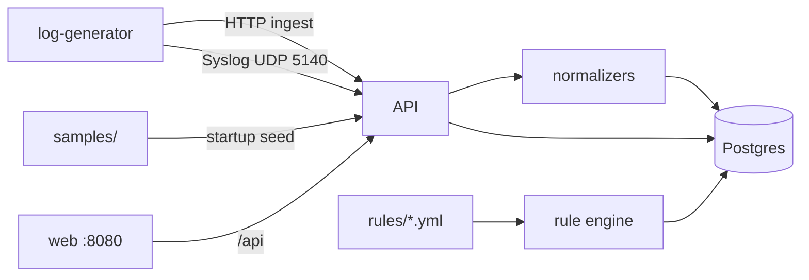

# Architettura

## Panoramica

DarkGreen SIEM è una **demo di portfolio** di una pipeline di log di sicurezza multi-fonte, ispirata ai flussi in stile LogPoint collect → normalize → search → detect. Non è affiliata a LogPoint/Guardsix e non è indurita per la produzione.

## Componenti

| Servizio | Ruolo |
|----------|-------|
| `postgres` | Store eventi + alert (label JSONB) |
| `api` | FastAPI ingest, search, stats, motore regole YAML, syslog UDP embedded |
| `web` | UI React (Dashboard, Ricerca, Sorgenti, Detection) dietro nginx |
| `log-generator` | Traffico demo multi-fonte continuo (HTTP + syslog) |

## Schema normalizzato (ECS-lite)

`timestamp`, `source_type`, `vendor`, `device`, `host`, `user`, `src_ip`, `dst_ip`, `action`, `severity`, `message`, `raw`, `labels`, `ingest_channel`

## Tipi di sorgente

1. **firewall** — syslog KV in stile FortiGate  
2. **windows** — Windows Event JSON  
3. **cloud_auth** — auth in stile Entra/Okta  
4. **siem_export** — export EDR/SIEM JSON (es. shape Cynet)

## Ricerca

Linguaggio query demo: token `field:value` combinati con free-text opzionale (`AND` è ignorato come operatore). Esempio: `src_ip:203.0.113.45 AND action:deny`.

## Detection

Regole YAML sotto `rules/`:

- `type: match` — qualsiasi evento recente che soddisfa i filtri sui campi  
- `type: threshold` — conteggio ≥ N raggruppato per un campo in una finestra temporale  

## Porte locali

- UI: http://localhost:8080  
- API: http://localhost:8000  
- Syslog UDP: 5140  
