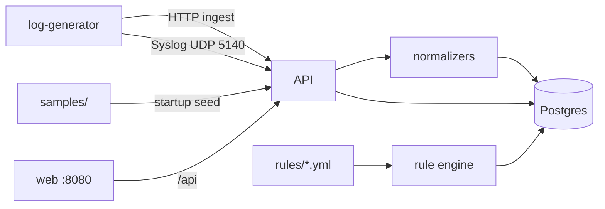

# Architecture

## Overview

DarkGreen SIEM is a **portfolio demo** of a multi-source security log pipeline inspired by LogPoint-style collect → normalize → search → detect flows. It is not affiliated with LogPoint/Guardsix and is not production-hardened.

## Components

| Service | Role |
|---------|------|
| `postgres` | Event + alert store (JSONB labels) |
| `api` | FastAPI ingest, search, stats, YAML rule engine, embedded syslog UDP |
| `web` | React UI (Dashboard, Search, Sources, Detections) behind nginx |
| `log-generator` | Continuous multi-source demo traffic (HTTP + syslog) |

## Normalized schema (ECS-lite)

`timestamp`, `source_type`, `vendor`, `device`, `host`, `user`, `src_ip`, `dst_ip`, `action`, `severity`, `message`, `raw`, `labels`, `ingest_channel`

## Source types

1. **firewall** — FortiGate-like syslog KV  
2. **windows** — Windows Event JSON  
3. **cloud_auth** — Entra/Okta-style auth  
4. **siem_export** — EDR/SIEM export JSON (e.g. Cynet-shaped)

## Search

Demo query language: `field:value` tokens combined with optional free-text (AND is ignored as an operator keyword). Example: `src_ip:203.0.113.45 AND action:deny`.

## Detection

YAML rules under `rules/`:

- `type: match` — any recent event matching field filters  
- `type: threshold` — count ≥ N grouped by a field inside a time window  

## Local ports

- UI: http://localhost:8080  
- API: http://localhost:8000  
- Syslog UDP: 5140  
