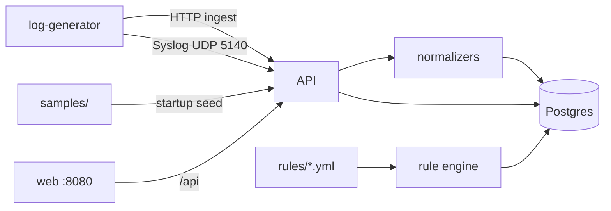

# Architettura

## Panoramica

DarkGreen SIEM è una **demo di portfolio** di una pipeline di log di sicurezza multi-fonte, ispirata ai flussi in stile LogPoint collect → normalize → search → detect. Non è affiliata a LogPoint/Guardsix e non è indurita per la produzione.

## Componenti

| Servizio | Ruolo |
|----------|-------|
| `postgres` | Store eventi + alert (label JSONB) |
| `api` | FastAPI ingest, search, stats, motore regole YAML, syslog UDP embedded |
| `web` | UI React (Dashboard, Ricerca, Sorgenti, Detection) dietro nginx |
| `log-generator` | Traffico demo multi-fonte continuo (HTTP + syslog) |

## Schema normalizzato (ECS-lite)

`timestamp`, `source_type`, `vendor`, `device`, `host`, `user`, `src_ip`, `dst_ip`, `action`, `severity`, `message`, `raw`, `labels`, `ingest_channel`

## Tipi di sorgente

1. **firewall** - FortiGate syslog KV (PRI/header strip, traffic + UTM virus/IPS, labels: logid, type/subtype, intf, policy, url, attack, ...)  
2. **windows** - Windows Event JSON  
3. **cloud_auth** - auth in stile Entra/Okta  
4. **siem_export** - export EDR/SIEM JSON (shape Cynet): `Activity`→action, process/hash/MITRE in `labels` (`process`, `hash`, `technique`, …)

## Multi-tenant e RBAC

Soft tenancy: `tenant_id` su eventi/alert/IOC (default `lab`). Tabelle `tenants` / `users`. Ruoli:

- `admin` - Setup, purge, regole
- `analyst` - search, alert write, regole, enrich
- `viewer` - solo GET
- `ingest` - solo ingest (machine token)

Isolamento rigido per riga: nessun cross-tenant.

## TLS e HA lab

- TLS: `docker-compose.tls.yml` + certs in `deploy/certs/`
- HA: `docker-compose.ha.yml` (api + api-b, nginx upstream). Postgres single; `lab_settings` in DB per override condivisi.

## Sicurezza e storage

- Syslog: size cap + rate limit; purge/silence per tenant; token invalidi se utente cancellato
- `AUTH_ENABLED=false` richiede `ALLOW_INSECURE_NO_AUTH=true`
- HA: solo `api` esegue rules/maintenance (`RUN_BACKGROUND_JOBS=false` su `api-b`); setup rilegge `lab_settings` da DB
- `events.raw` compresso zlib se >512B; log API rotanti+gzip; Docker log max-size

## Ricerca

Linguaggio query demo: token `field:value` combinati con free-text opzionale (`AND` è ignorato come operatore). Esempio: `src_ip:203.0.113.45 AND action:deny`.

## Detection

Regole YAML sotto `rules/`:

- `type: match` - qualsiasi evento recente che soddisfa i filtri sui campi (anche `labels.<key>` su JSONB)
- `type: threshold` - conteggio >= N raggruppato per un campo in una finestra temporale
- `type: correlation` - due (o piu) step di match uniti su `join_on` (es. spray + login_success)
- `mitre` - stringa o lista technique ID (persistita su alert)
- **Dedup/merge**: stessa rule + entity key entro `cooldown_minutes` aggiorna `evidence.occurrences` invece di creare un nuovo alert
- **Dry-run**: `POST /api/rules/dry-run` valuta in memoria senza scrivere alert
- **Notify**: webhook Slack/Teams su create di alert critical/high (Setup / env)
- **SLA**: minuti ack/close per severity (`lab_settings` + Setup); badge e filtro `?sla=` su alert; `acked_at` al leave-open, `closed_at` a closed

## Collectors

Vedi [collectors-windows-syslog.md](collectors-windows-syslog.md) (NXLog / rsyslog → UDP 5140). JSON Windows su syslog è normalizzato come `source_type=windows`.

## Porte locali

- UI: http://localhost:8080  
- API: http://localhost:8000  
- Syslog UDP: 5140  
